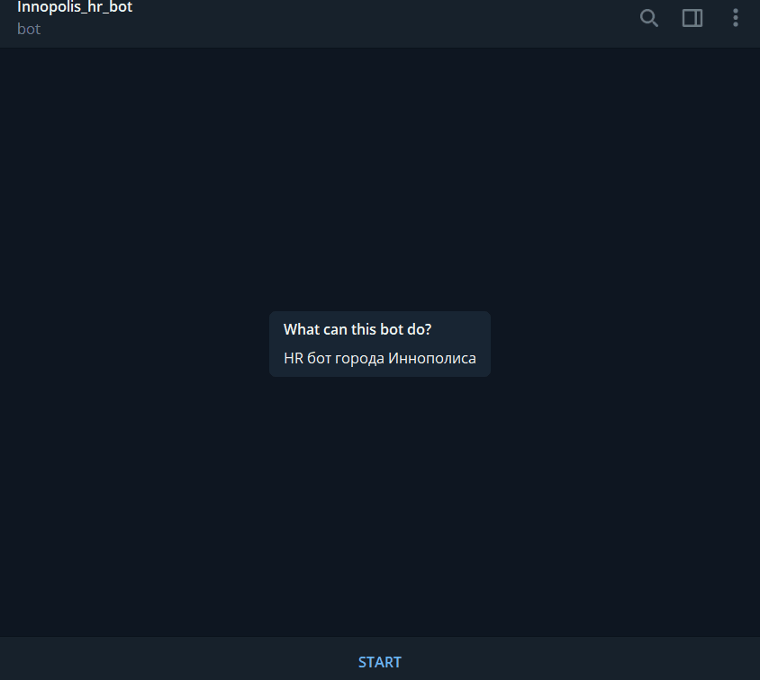

This Telegram bot was developed for the city of [Innopolis](https://en.wikipedia.org/wiki/Innopolis) , especially for the HR department.
Bot has a few number of dependencies and can work on cheap VPS.

## Prerequisites
You need Python 3.x.
```
pip install UnQLite
pip install python-telegram-bot --upgrade

```


## Installation
Clone this repo to your local machine.
```
git clone https://github.com/Deniskore/Innopolis_hr_bot.git
```

## Configuring
1. Invite @RawDataBot to your private Telegram channel to get the chat id
```
 "message": 
 {
    "chat": 
    {
        "id": -210987654,  <-----
        "title": ...,
        "type": "group",
    }
}
```
2. Open settings.json and modify ['botToken'](https://core.telegram.org/bots#6-botfather)
3. Change 'privateChannelId' to id which you got from @RawDataBot

## Running
Navigate to bot directory and create file run_bot.sh (with +x permission) with following contents
```
screen -dm bash -c 'python3.6 bot.py'
```
Then execute it!
```
./run_bot.sh
```
## Example of usage

